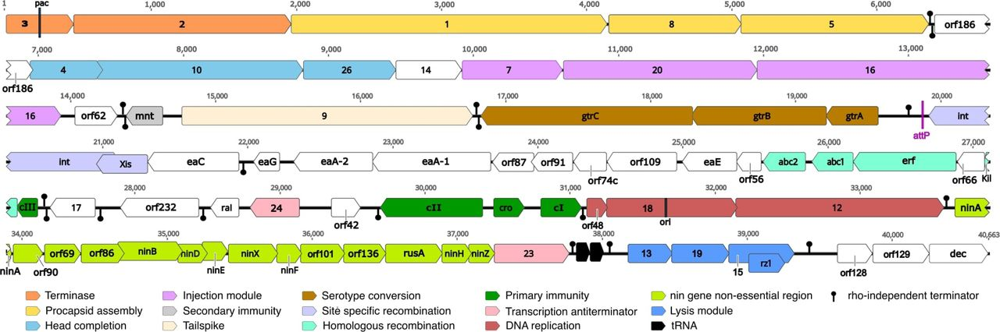

<h1 align="center">BioTracker</h1>

Разработка и реализация программного обеспечения для отслеживания и визуализации динамики биологических процессов

---

## Архитектура проекта

Для данного проекта была выбрана масштабируемая и удобная
frontend-архитектура [Feature-Sliced Design](https://feature-sliced.design/ "Документация по FSD") (сокращенно FSD):

Проект на FSD состоит из `слоев` (layers), каждый слой состоит из `слайсов` (slices) и каждый слайс состоит
из `сегментов` (segments). Слои стандартизированы во всех проектах и расположены вертикально. Модули на одном слое могут
взаимодействовать лишь с модулями, находящимися на слоях строго ниже. На данный момент слоев семь (снизу вверх):

1. `shared` — переиспользуемый код, не имеющий отношения к специфике приложения/бизнеса. (например, UIKit, libs, API)
2. `entities` (сущности) — бизнес-сущности. (например, User, Product, Order)
3. `features` (фичи) — взаимодействия с пользователем, действия, которые несут бизнес-ценность для пользователя. (
   например, SendComment, AddToCart, UsersSearch)
4. `widgets` (виджеты) — композиционный слой для соединения сущностей и фич в самостоятельные блоки (например,
   IssuesList, UserProfile).
5. `pages` (страницы) — композиционный слой для сборки полноценных страниц из сущностей, фич и виджетов.
6. `processes` (процессы, устаревший слой) — сложные сценарии, покрывающие несколько страниц. (например, авторизация)
7. `app` — настройки, стили и провайдеры для всего приложения.

Затем есть слайсы, разделяющие код по предметной области. Они группируют логически связанные модули, что облегчает
навигацию по кодовой базе. Слайсы не могут использовать другие слайсы на том же слое, что обеспечивает высокий уровень
связности (cohesion) при низком уровне зацепления (coupling).

В свою очередь, каждый слайс состоит из сегментов. Это маленькие модули, главная задача которых — разделить код внутри
слайса по техническому назначению. Самые распространенные сегменты — ui, model (store, actions), api и lib (
utils/hooks), но в вашем слайсе может не быть каких-то сегментов, могут быть другие, по вашему усмотрению.

## Использование

Для использования проекта достаточно клонировать его в вашу среду разработки с помощью
команды `git clone https://github.com/danyazavarin/diploma.git`. После этого следует инициализировать проект с
помощью команды `npm install`. Для запуска проекта воспользуйтесь сначала командой `yarn install`, а потом `yarn dev`.

## Технологии в проекте

- #### Npm:

Пакетный менеджер для JavaScript, который используется для управления зависимостями в проектах.

- #### Sass:

Препроцессор CSS, который добавляет дополнительные функции и возможности каскадных таблиц стилей.

- #### TypeScript:

Язык программирования, который является надстройкой над JavaScript, добавляющий статическую типизацию.

- #### React:

Библиотека JavaScript для создания пользовательских интерфейсов, основанная на компонентах.

- #### React-router-dom:

Библиотека для маршрутизации веб-приложений на основе React.

- #### Redux Toolkit:

Библиотека для JavaScript, предназначенная для управления состоянием приложения.

## Техническое описание проекта

### Использование Sass в WebStorm:

`File > Settings`, в открывшемся окошке перейти в раздел `Tools > File Watchers`, нажать на зеленый плюсик справа и
выбрать
`Sass\SCSS`.

### Использование TypeScript в WebStorm:

Достаточно создать файл с расширением `.ts`. Для транспиляции TypeScript в JavaScript надо прописать в
терминале `tsc ${путь до файла}`. Чтобы настроить свою конфигурацию, в терминал надо прописать `tsc --init`, появится
файл `tsconfig.json`, в котором можно выставить свои настройки.
